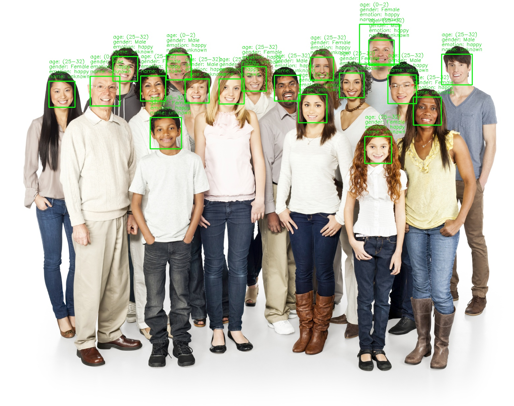

# Face, Emotion, Age, and Gender Detection Web Application

## Overview:
This project is a web-based application that allows users to upload images and automatically detect faces, emotions, estimated age, and gender in those images using advanced deep learning models. The integration of Flask, OpenCV, and FER provides a simple yet effective solution for these tasks.

## Tools Used:

- **Framework:** Flask for building the web application and handling user requests.
- **Computer Vision:** OpenCV for image processing, drawing bounding boxes, and handling deep learning models.
- **Face Detection:** MTCNN (Multi-Task Cascaded Convolutional Networks) for detecting faces within images.
- **Emotion Detection:** FER (Facial Expression Recognition) for identifying emotions like happiness, sadness, anger, etc.
- **Age and Gender Estimation:** Pre-trained models using Caffe, loaded with OpenCV's DNN module.

## Key Features:

### **File Upload:**
Users can upload images in formats like PNG, JPG, JPEG, and GIF through a user-friendly interface.

### **Face Detection:**
- The application uses the MTCNN model to detect faces in the uploaded images.
- Bounding boxes are drawn around the detected faces using OpenCV.

### **Emotion Detection:**
- For each detected face, the application recognizes emotions such as happiness, sadness, neutral, and more using the FER library.
  
### **Age and Gender Estimation:**
- The system predicts an estimated age range and gender for each detected face using pre-trained Caffe models.

## Impact:

This project demonstrates the practical integration of deep learning models into a web application. Users can seamlessly upload their images and receive comprehensive face analysis, including emotion, age, and gender predictions, without needing to understand the complexities of computer vision. It showcases how advanced Python libraries like OpenCV and FER can be used to create real-world applications with a smooth and interactive user experience.